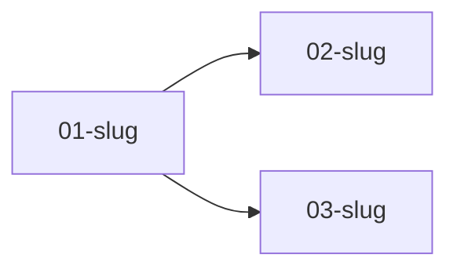

# Specify

**Goal**: Grill the demand until it is fully understood, then capture WHAT to build as **one self-contained spec per context/activity**, with testable, traceable requirements.

Two halves, in order:

1. **Grill** (section 1) - a relentless round-based interview over a design tree, backed by sub-agents that explore the codebase. Nothing is written while the frontier still has open questions.
2. **Split and write** (sections 2-5) - decompose the understood demand into contexts/activities and write one spec file per context, so each can be executed and verified on its own.

If the feature has ambiguous gray areas (multiple valid approaches for user-facing behavior), the agent will automatically trigger the [discuss gray areas](discuss.md) process within this phase. For clear, well-defined features, it goes straight to the next phase.

## Implicit-Requirement Dimensions

The canonical rubric for requirements that are easy to miss. Referenced by [discuss.md](discuss.md) - defined here, not duplicated.

| Dimension | What to cover |
| --------- | ------------- |
| Input validation & bounds | Limits, formats, sanitization |
| Failure / partial-failure states | Timeouts, partial saves, rollbacks |
| Idempotency / retry / duplicate handling | Safe retries, dedup keys |
| Auth boundaries & rate limits | Who can call what, throttle rules |
| Concurrency / ordering | Race conditions, ordering guarantees |
| Data lifecycle / expiry | TTL, archival, deletion |
| Observability | Logging, metrics, tracing hooks |
| External-dependency failure | Circuit breakers, fallbacks |
| State-transition integrity | Valid transitions, guards |

---

## Process

### 1. Grill the Demand

**Interview the user relentlessly until you reach a shared understanding.** Do not treat this as a checklist to complete - treat it as a **design tree** to walk: every decision branches into the decisions that hang off it. You are done when the tree has no unvisited branches, not when you have "enough to start".

**Load confirmed lessons first:** Before grilling, load the project's confirmed lessons so past verification failures shape this spec instead of repeating. Run `python3 <skill-dir>/scripts/lessons.py list --status confirmed` (optionally `--scope [area]` or `--query [term]` for the area this feature touches) and apply what comes back as guidance. Load only `confirmed` - never `candidate` or `quarantined`. If no store exists yet or no code tool is available, skip silently. See [lessons.md](lessons.md).

**Explore the project before the first round (Knowledge Verification Chain Step 1):** Scan existing code, patterns, conventions, and neighboring features relevant to this demand. Use what you find to ground every question in reality - not to constrain the spec to the current implementation. Keep it lightweight (stay within the <40k token budget; reuse the chain, no new machinery). The spec captures WHAT is needed, not only what exists.

**Open the interview.** Start open - let the user dump their mental model, and follow the energy: whatever they emphasize, dig into that. Then move to rounds.

#### Rounds and the frontier

The **frontier** is every decision whose prerequisites are already settled - the questions you can ask *now* without guessing at answers you haven't heard yet.

1. Compute the frontier.
2. **Ask the whole frontier in one round.** Number each question and give your recommended answer.
3. Wait for the user's answers. Do not ask a follow-up round before they reply.
4. Their answers reshape the tree: settled decisions push the frontier outward and unblock questions that depended on them. Recompute and ask the next round.

**A question whose answer depends on another question still open in this round belongs to a *later* round, not this one.** That rule is what keeps rounds from becoming form dumps of half-guessed questions.

#### Question format (use it verbatim)

```
❓ **Q1** - **<question title>**: <question body, may be multiple paragraphs, including concrete multiple-choice options>

➡️ <your recommended answer>
```

Every question carries a recommendation. You have read the codebase; the user should be able to accept or override in one word. Options must be concrete ("card layout" vs "table layout"), never "Option A" or "how should it look?".

#### Facts vs decisions

**Finding facts is your job, never the user's.** When a frontier question needs a fact from the environment (filesystem, existing code, config, dependency versions, current behavior), dispatch a sub-agent to find it - do not ask the user for anything you could look up yourself. A question you could have answered by reading the code erodes trust and wastes a turn.

**Do not block on a sub-agent.** A running exploration is an unsettled prerequisite: only the questions downstream of it wait for the report. Ask the rest of the frontier now.

**The decisions are the user's.** Scope, priorities, product behavior, trade-offs - put each to them and wait.

#### Challenge vagueness

Never accept a fuzzy answer. "Good" means what? "Users" means who? "Simple" means how? "Fast" means how many milliseconds? Make the abstract concrete: "Walk me through using this." "What does that actually look like when it fails?" An **ambiguous** answer is an unsettled node - it stays on the frontier.

#### Delegation settles a node - it does not reopen it

Distinguish two answers that look similar and are opposites:

| The user says | Node state | What you do |
| ------------- | ---------- | ----------- |
| "should feel fast", "make it good" | **unsettled** - ambiguous | push back once with a concrete alternative; it stays on the frontier |
| "you decide", "your call", "not specified - use your recommendation", silence after a direct ask | **settled by delegation** | take your recommended answer, log it as an assumption with its rationale, move on |

**Delegation is a decision.** Re-asking a question the user already handed you is the fastest way to turn grilling into interrogation. The recommendation you already stated becomes the answer; it goes in the owning spec's `Assumptions & Open Questions` table with `Confirmed? = n (agent's discretion)`, which is exactly what the closure gate requires.

#### Termination guards (the frontier must actually shrink)

Relentless is not endless. Stop grilling when any of these hits, and convert whatever is still open into logged assumptions:

- **The frontier is empty** - the normal exit.
- **A round settles nothing new.** If a full round produces no newly settled decision, the remaining questions are not answerable by this user right now. Say so, log them as assumptions with your recommendations, and move on.
- **Depth cap by scope.** Medium: 2 rounds. Large/Complex: 5 rounds. Hitting the cap is a signal that the demand is bigger than one feature - propose splitting it rather than grinding out a sixth round.
- **The user says stop** ("just build it", "enough questions"). Immediately convert every open node to an assumption and present the set for confirmation.

An open question that becomes a logged assumption is a *closed* node. Nothing is silently assumed - that is the invariant, not "the user answered everything".

#### When the session ends

The grilling is done when the frontier is empty **or a termination guard fired and every remaining node is a logged assumption**. Then state the shared understanding back in a few lines - including the assumptions you took on delegated or unanswered nodes - and **wait for the user to confirm it**. Do not write `overview.md` or any spec file before that confirmation.

**Scope-tiered depth:**

| Scope | Grilling depth |
| ----- | -------------- |
| Small | Skip the rounds - restate the one-liner and confirm it back |
| Medium | 1-2 rounds; frontier limited to decisions that actually change the build |
| Large / Complex | Full walk to an empty frontier, with codebase sub-agents feeding the factual branches |

**Then run the dimensions sweep.** With the frontier empty, run a closing **implicit-requirement dimensions sweep** before offering to proceed:

- **Large / Complex:** Cover every dimension above - each must resolve to a requirement OR an explicit `N/A because [reason]`. No blank entries allowed.
- **Medium:** Cover only dimensions obviously present for this feature's domain; collapse the rest to a single `remaining dimensions N/A for this scope`.
- **Small:** Skip the sweep entirely.

The `N/A because...` escape is mandatory - it prevents inventing requirements to fill the checklist. Bound the sweep to THIS feature's scope; never add requirements outside the feature boundary.

### 2. Decompose into Per-Context Specs

**One spec per context/activity. Never one spec per feature.** The unit of a spec file is a *context* - a cohesive slice of the demand that can be built, tested, and verified without the rest of the feature being finished. A worker picks up one spec file, reads it, and executes; it never has to read its siblings.

**Skip this step for Small scope only** (≤3 files, one sentence) - write the one-liner spec inline and move on.

#### How to find the seams

Cut where the *activity* changes, not where the code layers change. A good spec boundary is one you could hand to a different person on a different day.

| Good seam (one spec each) | Bad seam (not a spec) |
| ------------------------- | --------------------- |
| One endpoint / one command / one job | "the controller layer" |
| One integration with one external system | "the DTOs" |
| One state transition or lifecycle rule | "error handling" as a cross-cutting file |
| One migration / one backfill | "write the tests" |
| One user-visible screen or flow step | "refactor first" |

**Layer splits are wrong** because no layer is independently verifiable - a controller with no service proves nothing. A context spec cuts *vertically*: it owns everything it needs to demonstrate its own acceptance criteria.

#### Sizing rules

- A spec should carry **1-5 user stories** and imply roughly **3-10 tasks**.
- More than ~10 tasks implied → split it at a real activity seam.
- Fewer than ~2 acceptance criteria, or it cannot be demoed alone → merge it into the spec it serves.
- A spec that exists only to unblock another spec (shared scaffolding, a shared client, a schema both need) is legitimate - name it as such and let the dependents declare `Depends on` it.

#### Naming, IDs, dependencies

- File: `.specs/features/[feature]/specs/NN-[slug].md`. `NN` is a two-digit reading order (`01`, `02`, …); `[slug]` is kebab-case and describes the activity (`01-webhook-recebimento`, `02-idempotencia`).
- The spec's **ID** is its filename stem. Nothing else identifies it.
- Requirement IDs inside a spec use a **prefix unique to that spec** (`WEBHOOK-01`, `IDEMP-01`, …). Two specs must never mint the same requirement ID.
- Ordering constraints go in the spec's `Depends on` field **and** in `overview.md`'s dependency graph. Both must agree; `validate_spec.py` checks that dependencies resolve to real spec IDs and that the graph has no cycle.
- A dependency means "cannot start until that spec is verified". If two specs merely touch the same file, that is not a dependency - it is a merge candidate or a sequencing note.

#### Self-containment contract (this is what makes parallelism work)

Every spec file MUST carry, in its own body:

1. A **Shared Context** digest - 3-6 lines: what the feature is, and only the parts of it this spec needs. Copy it; do not link to `overview.md` and expect the worker to open it.
2. Its **Scope** and **Out of Scope** - stated locally, so the worker cannot drift into a sibling spec's territory.
3. Its **own** user stories, acceptance criteria, edge cases, assumptions, and requirement traceability.
4. Its **Depends on** / **Depended on by** lines.

Redundancy between specs is acceptable and intended. Coupling between specs is not.

#### Present the split before writing

Show the proposed spec list (ID, one-line scope, dependencies) and get the user's agreement on the *boundaries* before writing any spec body. A wrong seam is expensive to unpick after the ACs are written.

### 3. Capture User Stories with Priorities

**P1 = MVP** (must ship), **P2** (should have), **P3** (nice to have)

Each story MUST be **independently testable** - you can implement and demo just that story. Stories live inside the spec that owns their context; priorities are compared across the whole feature (a spec can hold only P2 stories).

### 4. Write Acceptance Criteria (EARS notation)

Write every acceptance criterion in **EARS** (Easy Approach to Requirements Syntax). Each criterion resolves to exactly one pattern, which keeps it unambiguous and directly testable. Choose the pattern that fits the requirement instead of forcing everything into a single shape:

| Pattern | Keyword | Template | Use for |
| ------- | ------- | -------- | ------- |
| Ubiquitous | (none) | The [system] SHALL [response] | Always-on invariants and constraints |
| Event-driven | WHEN | WHEN [trigger] THEN the [system] SHALL [response] | A response to a discrete trigger |
| State-driven | WHILE | WHILE [state] the [system] SHALL [response] | Behavior that holds during a state |
| Optional-feature | WHERE | WHERE [feature is present] the [system] SHALL [response] | Behavior gated behind an optional capability or flag |
| Unwanted-behavior | IF / THEN | IF [undesired condition] THEN the [system] SHALL [response] | Errors, failures, invalid input, timeouts |
| Complex | combination | WHILE [state], WHEN [trigger] the [system] SHALL [response] | Richer behavior combining the above |

**Why patterns beat one shape:** failure states, state transitions, and optional behavior become first-class criteria instead of footnotes squeezed into WHEN/THEN. The patterns map onto the implicit-requirement dimensions above: state-transition integrity to State-driven; failure and external-dependency failure to Unwanted-behavior; feature flags to Optional-feature.

**Rules:** one requirement per criterion (never bundle two behaviors); use concrete values (a specific status code, a specific message, a bound) rather than "quickly" or "gracefully"; every criterion contains a SHALL and is measurable. `python3 <skill-dir>/scripts/validate_spec.py` flags any criterion without a SHALL and any that matches no recognized pattern.

### 5. Requirement Closure Gate (before confirm)

Before presenting the specs for confirmation, run the three checks below **per spec file**. No spec is presentable for confirmation until every item in it is resolved or assumption-logged - this is the guarantee that no requirement leaves the spec silently unclear.

**Scope-tiered:** Large/Complex = full gate; Medium = resolve obvious ambiguities, log the rest as assumptions; Small = skip entirely (consistent with skipping the sweep).

1. **Unambiguity + precision (hard).** Every AC must (a) have a single interpretation and (b) define a precise, spec-defined expected outcome. Any AC that fails either check: resolve with the user, split it, or log it as an explicit assumption with the chosen interpretation and rationale. No AC proceeds readable two ways or with an undefined outcome.

2. **Open-questions / assumptions closure.** Enumerate every unresolved decision that surfaced during clarification. Each must be either (a) resolved with the user OR (b) recorded as an **assumption** (chosen default + rationale) in the spec's Assumptions & Open Questions section. Nothing proceeds unmarked.

3. **Declined gray areas become assumptions.** Any gray area the user declined to discuss or that went undiscussed is written to the spec's Assumptions & Open Questions section (agent's chosen default + rationale) - never silently dropped. See [discuss.md](discuss.md).

Fix inline. This gate is bounded to THIS feature's stated dimensions and actual behavior - never to "anything imaginable." The Out of Scope table and anti-scope-creep rules remain the counterweights: the gate clarifies existing requirements, it never invents new ones.

**Deterministic backing (run before you present the specs).** The structural half of this gate is enforced by a script so it cannot drift when a step is forgotten: `python3 <skill-dir>/scripts/validate_spec.py <feature>` walks `overview.md` **and every file under `specs/`** and checks that required sections exist, every AC is EARS-shaped (has a SHALL), no Assumptions row has an empty default or rationale, requirement IDs are well-formed and unique across the feature, the Spec Index matches the files on disk, and every `Depends on` resolves to a real spec with no cycles. A non-zero exit means fix before confirming. The script checks structure; you still own the judgment calls (is the interpretation right, is the outcome precise, is the seam in the right place). If no code-execution tool is available, run the same checks by reading the files.

---

## Template A: `.specs/features/[feature]/overview.md`

Feature-level only. Short by design - it is never required reading for executing a single spec.

````markdown
# [Feature Name] Overview

## Problem Statement

[Describe the problem in 2-3 sentences. What pain point are we solving? Why now?]

## Goals

- [ ] [Primary goal with measurable outcome]
- [ ] [Secondary goal with measurable outcome]

## Out of Scope

Explicitly excluded at the FEATURE level. Documented to prevent scope creep. Each spec also carries its own local Out of Scope.

| Item        | Reason         |
| ----------- | -------------- |
| [Feature X] | [Why excluded] |
| [Feature Y] | [Why excluded] |

---

## Spec Index

One spec per context/activity. Every file under `specs/` appears here; every row points to a real file.

| Spec ID | Scope (one line) | Depends on | Priority | Status |
| ------- | ---------------- | ---------- | -------- | ------ |
| `01-[slug]` | [what this context delivers] | - | P1 | Draft |
| `02-[slug]` | [what this context delivers] | `01-[slug]` | P1 | Draft |
| `03-[slug]` | [what this context delivers] | `01-[slug]` | P2 | Draft |

**Status values:** Draft → Approved → In Progress → Verified

---

## Spec Dependency Graph

Must agree with every spec's `Depends on` field. No cycles.



Specs with no incoming edge can start immediately and in parallel.

---

## Shared Context

The digest every spec copies into its own body. Keep it to 3-6 lines - if it grows, it is design, and belongs in `design.md`.

- [System / module this feature lives in]
- [Key existing component or convention every spec must respect]
- [Global constraint: auth model, tenancy, transaction boundary, …]
````

---

## Template B: `.specs/features/[feature]/specs/NN-[slug].md`

**One file per context/activity.** Self-contained: an agent reads only this file (plus its tasks) and can execute.

```markdown
# [NN-slug] [Context Name]

**Feature:** [feature-name]
**Spec ID:** `NN-[slug]`
**Depends on:** [`NN-[slug]`, … | none]
**Depended on by:** [`NN-[slug]`, … | none]
**Requirement prefix:** `[PREFIX]`
**Status:** Draft | Approved | In Progress | Verified

---

## Shared Context

[3-6 lines copied from overview.md - only the parts this spec needs. Copied on purpose: the worker must not have to open another file.]

---

## Scope

[What THIS context delivers, in 1-3 sentences. Concrete enough that "done" is obvious.]

## Out of Scope (this spec)

| Item | Reason / owner |
| ---- | -------------- |
| [thing that looks related] | [why not here - e.g. "owned by `03-[slug]`"] |

---

## Assumptions & Open Questions

Every ambiguity is resolved or recorded here - nothing is left silently unclear.

| Assumption / decision | Chosen default  | Rationale | Confirmed? |
| --------------------- | --------------- | --------- | ---------- |
| [ambiguity]           | [what we'll do] | [why]     | [y/n]      |

**Open questions:** none - all resolved or logged above (required before the spec is confirmed).

---

## User Stories

### P1: [Story Title] ⭐ MVP

**User Story**: As a [role], I want [capability] so that [benefit].

**Why P1**: [Why this is critical for MVP]

**Acceptance Criteria** (each line is one EARS pattern):

1. WHEN [user action/event] THEN system SHALL [expected behavior]  <!-- event-driven -->
2. IF [invalid input / failure] THEN system SHALL [graceful handling]  <!-- unwanted-behavior -->
3. WHILE [state holds] system SHALL [behavior during that state]  <!-- state-driven -->
4. The system SHALL [always-on invariant]  <!-- ubiquitous -->

**Independent Test**: [How to verify this story works alone - e.g., "Can demo by doing X and seeing Y"]

---

### P2: [Story Title]

**User Story**: As a [role], I want [capability] so that [benefit].

**Why P2**: [Why this isn't MVP but important]

**Acceptance Criteria**:

1. WHEN [event] THEN system SHALL [behavior]
2. WHEN [event] THEN system SHALL [behavior]

**Independent Test**: [How to verify]

---

### P3: [Story Title]

**User Story**: As a [role], I want [capability] so that [benefit].

**Why P3**: [Why this is nice-to-have]

**Acceptance Criteria**:

1. WHEN [event] THEN system SHALL [behavior]

---

## Edge Cases

Edge cases are usually unwanted-behavior (IF/THEN) or boundary (WHEN) criteria:

- IF [error scenario] THEN system SHALL [graceful handling]
- IF [unexpected input] THEN system SHALL [validation response]
- WHEN [boundary condition] THEN system SHALL [behavior]

---

## Requirement Traceability

Each requirement gets an ID unique across the whole feature, using this spec's prefix.

| Requirement ID | Story       | Phase  | Status  |
| -------------- | ----------- | ------ | ------- |
| [PREFIX]-01    | P1: [Story] | Design | Pending |
| [PREFIX]-02    | P1: [Story] | Design | Pending |
| [PREFIX]-03    | P2: [Story] | -      | Pending |

**ID format:** `[PREFIX]-[NUMBER]` where `[PREFIX]` belongs to THIS spec only (e.g., `WEBHOOK-01`, `IDEMP-03`, `RECON-02`)

**Status values:** Pending → In Design → In Tasks → Implementing → Verified

**Coverage:** X total, Y mapped to tasks, Z unmapped ⚠️

---

## Done Criteria (this spec)

How we know THIS context is complete - verifiable without any sibling spec being finished:

- [ ] [Measurable outcome - e.g., "POST /webhook returns 202 for a valid payload"]
- [ ] [Measurable outcome - e.g., "Duplicate event id produces exactly one record"]
```

---

## Worked Example: one feature, three specs

Demand: "receber webhooks de pagamento e conciliar".

| Spec | Scope | Depends on | Prefix |
| ---- | ----- | ---------- | ------ |
| `01-webhook-recebimento` | Accept the provider callback, validate the signature, persist the raw event, return 202 | none | `WEBHOOK` |
| `02-idempotencia` | Guarantee one processed record per provider event id under retry and concurrency | `01-webhook-recebimento` | `IDEMP` |
| `03-reconciliacao` | Nightly job that reconciles persisted events against the provider's statement | `01-webhook-recebimento` | `RECON` |

`02` and `03` both depend on `01` and on nothing else - once `01` is verified, they can run in parallel, each worker reading a single spec file.

What would have been wrong: `01-controller`, `02-service`, `03-repository`. No layer is demoable alone, all three would have to be verified together, and nothing could be parallelized.

---

## Tips

- **Grill first, write second** - no file is created while the frontier still has open questions
- **One round = the whole frontier** - numbered questions, each with a recommendation; then wait
- **"You decide" is an answer** - log your recommendation as an assumption and move on; never re-ask a delegated question
- **A round that settles nothing ends the grilling** - convert what is left to assumptions rather than grinding
- **Look it up, don't ask** - facts come from sub-agents reading the codebase; only decisions go to the user
- **One spec per context/activity** - cut vertically at activity seams, never by code layer
- **Self-contained beats DRY** - copy the shared-context digest into every spec; a worker must never need a second file to understand the first
- **P1 = Vertical Slice** - A complete, demo-able capability, not just backend or frontend
- **EARS is code** - If you can't write a criterion as a test, rewrite it; pick the pattern (WHEN / WHILE / WHERE / IF / ubiquitous) that fits
- **Requirement IDs are mandatory and prefix-unique** - two specs never mint the same ID
- **Edge cases matter** - What breaks? What's empty? What's huge?
- **Out of Scope prevents creep** - at both levels: the feature's, and each spec's
- **Closure gate before confirm** - Three checks per spec: unambiguity + precision, open-questions/assumptions closure, declined gray areas logged; scope-tiered; bounded to stated dimensions; never invents requirements
- **Confirm after the gate passes** - Present the spec set for user confirmation only after the closure gate passes for every spec and `validate_spec.py` exits clean; user approves before moving to discuss phase
